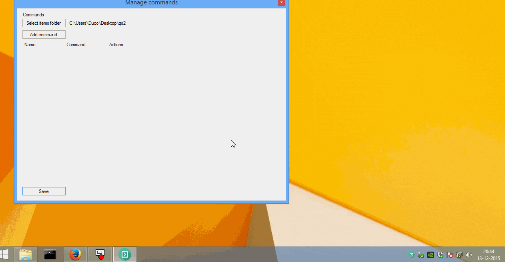

# quickstart2
QuickStart2 is a lightweight tool which resides in the system tray of Windows. Quickly add commands to its menu.

**NOTE: Icon by [GraphicLoads](http://www.iconarchive.com/show/100-flat-2-icons-by-graphicloads/arrow-next-2-icon.html).

*The commands you fill in, are executed one-on-one on the command line*

# Downloads

* [0.0.1 (2015-12-13)](http://duc.gr/qs2-001)